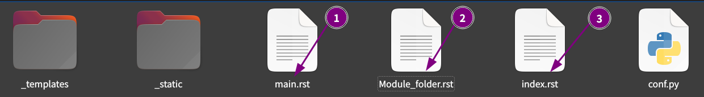
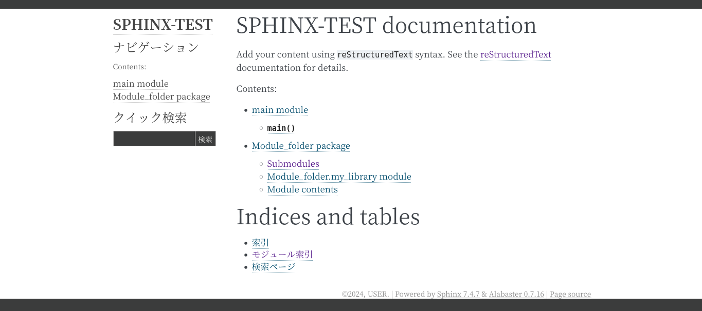

# sphinxによるドキュメント化とGitHub Actionsによる自動デプロイ

## はじめに
3ヶ月後の自分は他人、とはよく言ったもので、特に自動化をしていた部分に関しては、なにをどうやってこのようなシステムを作ったのか全く覚えていないことがあります。
わたしの場合、`sphinx`によってドキュメントを自動デプロイする環境を作り、それを忘れないためにドキュメント化をしていたのですが、悪いことにドキュメントを完成させずにドキュメントの存在自体を忘れ、時間と労力を無駄にしました。
さきほどその作りかけのドキュメントを発見し、膝から崩れ落ちるとはこの事か…という気分を味わいました。
`sphinx`でのハマりどころの解法が書いてありました。書いてありましたとも。

ですので襟を正してアウトプットをしておきます。


## 環境
```bash
$ inxi -Sxxx --filter
System:
  Kernel: 6.5.0-44-generic x86_64 bits: 64 compiler: N/A Desktop: Unity
    wm: gnome-shell dm: GDM3 42.0 Distro: Ubuntu 22.04.4 LTS (Jammy Jellyfish)
```

## 大まかな流れ
ここでは新しく`sphinx-test`というプロジェクトフォルダを作り、ここに`sphinx`を使ってドキュメント環境を構築していきます。

### ディレクトリ構造とそれぞれのコード内容
```bash
user@user:~/bin/sphinx-test$ tree
.
├── Module_folder
│   ├── __init__.py
│   └── my_library.py
└── main.py
```

それぞれのファイルの内容は以下のようにします。

```python: main.py
from Module_folder.my_library import greet


def main():
    """
    メイン関数。Module-folder/my_library.pyのgreet関数を呼び出して出力します。

    Example:
        実行方法:
        $ python main.py

    """
    greet()


if __name__ == "__main__":
    main()

```

```python: Module_folder/my_library.py
def greet():
    """
    挨拶を表示する関数。

    This function prints a welcome message to the console.

    Example:
        実行例:
        >>> greet()
        こんにちは、Sphinxテスト環境へようこそ！

    """
    print("こんにちは、Sphinxテスト環境へようこそ！")

```
`__init__.py`の中身はカラでOkです。

### `python仮想環境`を作成
プロジェクトフォルダに`python仮想環境`を作成します。
```bash
python3 -m venv .venv
. .venv/bin/activate
pip install -U pip setuptools wheel
```

### モジュールや拡張のインストール
`pyproject.toml`を使用してモジュールなどのインストールを行います。
```bash
[build-system]
requires = ["setuptools>=42", "wheel"]
build-backend = "setuptools.build_meta"

[project]
name = "sphinx-test"
version = "0.1.0"
requires-python = ">=3.8"
dependencies = [
    "sphinx",
    "sphinx-rtd-theme",
    "myst-parser"
]
license = {file = "LICENSE"}
readme = "README.md"
description = "A test project for Sphinx documentation"
authors = [
    { name = "Your Name", email = "your.email@example.com" }
]
keywords = ["sphinx", "documentation"]

[project.urls]
Homepage = "https://yourhomepage.com/"
Documentation = "https://yourdocumentation.com/"
Repository = "https://github.com/yourusername/sphinx-test"

[tool.setuptools]
include-package-data = true

[tool.setuptools.packages.find]
where = ["Module_folder"]
```

`pyproject.toml`を作成した後、以下のコマンドでインストールを行います。
```bash
pip install .
```

### 動作確認
```bash
(.venv) user@user:~/bin/sphinx-test$ python main.py
こんにちは、Sphinxテスト環境へようこそ！
```
成功です。

さて、現在のディレクトリ構造は以下のようになっています。
```bash
user@user:~/bin/sphinx-test$ tree -L 2 -F
sphinx-test
├── Module_folder/
│   ├── __init__.py
│   ├── __pycache__/
│   ├── my_library.py
│   └── sphinx_test.egg-info/
├── build/
│   └── bdist.linux-x86_64/
├── main.py
└── pyproject.toml
```
それではここから`sphinx`によるドキュメント自動生成を行います。

### `sphinx`によるドキュメント自動生成
`sphinx-quickstart`コマンドにて、雛形の生成を行います。

```bash
(.venv) user@user:~/bin/sphinx-test$ sphinx-quickstart --sep
Sphinx 7.4.7 クイックスタートユーティリティへようこそ。

以下の設定値を入力してください（Enter キーのみ押した場合、
かっこで囲まれた値をデフォルト値として受け入れます）。

選択されたルートパス: .

プロジェクト名は、ビルドされたドキュメントのいくつかの場所にあります。
> プロジェクト名: SPHINX-TEST
> 著者名（複数可）: USER
> プロジェクトのリリース []: 0.1

ドキュメントを英語以外の言語で書く場合は、
 言語コードで言語を選択できます。Sphinx は生成したテキストをその言語に翻訳します。

サポートされているコードのリストについては、
https://www.sphinx-doc.org/en/master/usage/configuration.html#confval-language を参照してください。
> プロジェクトの言語 [en]: ja

ファイル /home/user/bin/sphinx-test/source/conf.py を作成しています。
ファイル /home/user/bin/sphinx-test/source/index.rst を作成しています。
ファイル /home/user/bin/sphinx-test/Makefile を作成しています。
ファイル /home/user/bin/sphinx-test/make.bat を作成しています。

終了：初期ディレクトリ構造が作成されました。

マスターファイル /home/user/bin/sphinx-test/source/index.rst を作成して
他のドキュメントソースファイルを作成します。次のように Makefile を使ってドキュメントを作成します。
 make builder
"builder" はサポートされているビルダーの 1 つです。 例: html, latex, または linkcheck。
```

ディレクトリ構造は以下のように変化します。
```bash
(.venv) user@user:~/bin/sphinx-test$ tree -L 2 -F
./
├── Makefile                      # <-- NEW
├── Module_folder/
│   ├── __init__.py
│   ├── __pycache__/
│   ├── my_library.py
│   └── sphinx_test.egg-info/
├── build/
│   └── bdist.linux-x86_64/
├── main.py
├── make.bat                      # <-- NEW
├── pyproject.toml
└── source/                       # <-- NEW
    ├── _static/
    ├── _templates/
    ├── conf.py
    └── index.rst
```
`Makefile`, `make.bat`, `source`ディレクトリが新たに作成されました。

それでは`source/conf.py`をみてみましょう。

### `source/conf.py`を編集する
新たに作成された`conf.py`は以下ののようになっています。
```python: conf.py
# -- Project information -----------------------------------------------------
# https://www.sphinx-doc.org/en/master/usage/configuration.html#project-information

project = 'SPHINX-TEST'
copyright = '2024, USER'
author = 'USER'
release = '0.1'

# -- General configuration ---------------------------------------------------
# https://www.sphinx-doc.org/en/master/usage/configuration.html#general-configuration

extensions = []

templates_path = ['_templates']
exclude_patterns = []

language = 'ja'

# -- Options for HTML output -------------------------------------------------
# https://www.sphinx-doc.org/en/master/usage/configuration.html#options-for-html-output

html_theme = 'alabaster'
html_static_path = ['_static']
```
この `conf.py`ファイルを修正します。

いま`conf.py`はプロジェクトルートディレクトリの`source`フォルダにあります。この位置だとパスをプロジェクトルートディレクトリに合わせる必要があります。
そこで`conf.py`にパスを通す修正を加える必要があります。

```python
import os
import sys

sys.path.append(os.path.abspath(".."))
for i in sys.path:
    print(i)
```

> ![NOTE]
> `conf.py`における最後の2行の`for文`ですが、これを加えることを推奨します。
> プロジェクトルートディレクトリから`conf.py`を実行する場合が主だと思いますが、それ以外のディレクトリから実行した場合、*相対パスで記述しているため思わぬパスが加えられている場合がある*からです。`for文`を追加することで、追加されたパスを確認できます。


またスクリプトファイルの`docstring`からドキュメントを作成するため、`sphinx.ext.autodoc`, `sphinx.ext.napoleon`を指定する必要があります。
なお、`napoleon`では`google形式のドキュメント`を認識するよう`napoleon_google_docstring`を`True`にする必要があります。
```python
extensions = [
    'sphinx.ext.napoleon',
    'sphinx.ext.autodoc',
]
# Napoleon settings
napoleon_google_docstring = True
```
これらを`conf.py`に加筆修正します。
もしマークダウンで書かれたドキュメントがあるのなら、以下の拡張も必要になります。
`conf.py`を以下のように修正します。
```python: conf.py
extensions = [
    'sphinx.ext.napoleon',
    'sphinx.ext.autodoc',
    'myst_parser',
]

source_suffix = {
    '.rst': 'restructuredtext',
    '.md': 'markdown'
}

source_parsers = {
    '.md': 'recommonmark.parser.CommonMarkParser',
}

```

## `sphinx`をビルドする
ここまで用意が出来たら`sphinx`をビルドします。
### `sphinx-apidoc`
`sphinx-apidoc -f -o {conf.pyのあるディレクトリ} {プロジェクトルートディレクトリ}`
`sphinx-apidoc -f -o {conf.pyのあるディレクトリ} {モジュールのあるディレクトリ}`
APIドキュメントのソースファイルを生成します。
`docstring`を含むスクリプトファイルが存在するディレクトリに対して複数回実行する必要があります。（少なくともわたしの場合は）
`-o`で指定した`{conf.pyのあるディレクトリ}`は、新たに作成したドキュメント用のディレクトリを選んでもOk。
`sphinx-apidoc`を実行することにより、出力先のディレクトリに`rstファイル`が作成されます。
これらの`rstファイル`を`index.rst`に記述することにより、各ドキュメントの関連付けが行われます。
この関連付けに矛盾点があると、次に実行する`sphinx-build`コマンドでエラーが出力されます。


## `rst`ファイルを修正する
この時点で、`source`ディレクトリには複数の`rst`ファイルが作成されているはずです。（作成されていない場合はもじゅーるが含まれるディレクトリを対象に、`sphinx-apidoc`を再度実行してください。


`index.rst`が`HTML`でいうところの`index.html`、つまりドキュメントのホームページになります。
`index.rst`に`main.rst`と`Module_folder.rst`へのリンクを貼ります。
このとき、拡張子は省略可能です。

### `index.rst`
```bash
SPHINX-TEST documentation
=========================

Add your content using ``reStructuredText`` syntax. See the
`reStructuredText <https://www.sphinx-doc.org/en/master/usage/restructuredtext/index.html>`_
documentation for details.

.. toctree::
   :maxdepth: 2
   :caption: Contents:

   main                     # <-- 加筆
   Module_folder            # <-- 加筆

Indices and tables
==================

* :ref:`genindex`
* :ref:`modindex`
* :ref:`search`
```
### `main.rst`
```bash
main module
===========

.. automodule:: main
   :members:
   :undoc-members:
   :show-inheritance:
```
### `Module_folder.rst`
```bash
Module\_folder package
======================

Submodules
----------

Module\_folder.my\_library module
---------------------------------

.. automodule:: Module_folder.my_library
   :members:
   :undoc-members:
   :show-inheritance:

Module contents
---------------

.. automodule:: Module_folder
   :members:
   :undoc-members:
   :show-inheritance:
```

### `sphinx-build`
`sphinx-build -a -b html -E {conf.pyのあるディレクトリ} {ドキュメントフォルダ}`
`conf.py`に基づいて、指定されたフォーマット(html等)のドキュメントを生成します。

プロジェクトルートディレクトリで実行します。
```bash
sphinx-build -a -b html -E source doc
```

うまくいけば、下記のようにドキュメントが生成されます。（`doc/index.html`）


## `theme`の変更
テーマ変更についてはたくさんのドキュメントがウェブにありますので、ここでは簡単に紹介します。
ロゴを追加します。


### `read the docs`の場合
以下を追加修正します。
```bash
html_theme = 'sphinx_rtd_theme'
html_logo = 'https://raw.githubusercontent.com/yKesamaru/sphinx_documentation/master/assets/logo.png'
html_favicon = 'https://raw.githubusercontent.com/yKesamaru/sphinx_documentation/master/assets/logo.ico'
```
変更が終わったら`sphinx-build`を実行します。
